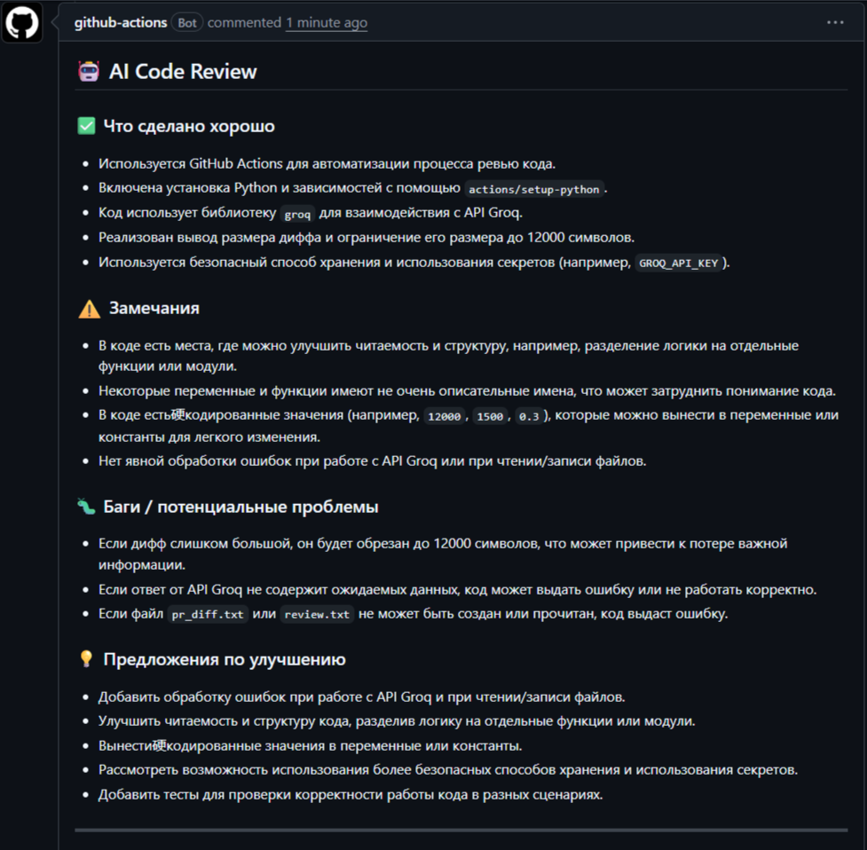

Лабораторная работа №12
AI-ассистированная разработка

Студент: Туманян Лина Врежовна  
Группа: 220032-11  
Вариант: 27 (Платформа для онлайн-торговли акциями)  
Уровень сложности: Повышенный

Выполненные задания:
- Задание 1 — Полноценное веб-приложение
- Задание 2 — Code review сгенерированного кода
- Задание 4 — Интеграция ИИ в CI/CD
- Задание 7 — Генерация unit-тестов с покрытием ≥90%

Задание 1:

О проекте:

Веб-приложение для онлайн-торговли акциями. Пользователи могут:
- Регистрироваться и входить в систему (JWT аутентификация)
- Просматривать список доступных акций с текущими ценами
- Покупать и продавать акции
- Смотреть свой портфель (количество акций, средняя цена, текущая стоимость, прибыль/убыток)
- Просматривать историю транзакций

Технологии:

| Технология | Назначение |
|------------|------------|
| FastAPI | Веб-фреймворк |
| SQLAlchemy | ORM для работы с БД |
| SQLite | База данных (для разработки) |
| JWT | Аутентификация |
| Pydantic | Валидация данных |
| Uvicorn | ASGI сервер |

Сущности:

| Модель | Описание |
|--------|----------|
| User | Пользователь (email, username, баланс) |
| Stock | Акция (символ, название, текущая цена) |
| Portfolio | Портфель (связь пользователя с акциями, количество, средняя цена) |
| Transaction | Транзакция (покупка/продажа, количество, цена, сумма) |

Установка и запуск

1. Клонировать репозиторий

```bash
git clone <url-репозитория>
cd laba12

2. Создать виртуальное окружение
```bash
python -m venv venv
source venv/bin/activate      # Mac/Linux
venv\Scripts\activate         # Windows

3. Установить зависимости
```bash
pip install -r requirements.txt

4. Настроить переменные окружения
Создать файл .env (скопировать из .env.example):

```bash
cp .env.example .env
.env.example содержит:

env
DATABASE_URL=sqlite:///./trading.db
SECRET_KEY=your-super-secret-key-change-this-in-production
ACCESS_TOKEN_EXPIRE_MINUTES=30

5. Запустить приложение
```bash
uvicorn app.main:app --reload
Сервер запустится на http://localhost:8000

API Эндпоинты: 

        Аутентификация
Метод	Эндпоинт	        Описание
POST	/auth/register	    Регистрация пользователя
POST	/auth/login	        Вход, получение JWT токена

        Акции
Метод	Эндпоинт	        Описание
GET	    /stocks	            Список всех акций
GET	    /stocks/{symbol}	Информация об акции

        Портфель
Метод	Эндпоинт	        Описание
GET	    /portfolio	        Текущий портфель с расчётом P&L

        Транзакции
Метод	Эндпоинт	        Описание
POST	/transactions/buy	Покупка акций
POST	/transactions/sell	Продажа акций
GET	    /transactions	    История сделок (с пагинацией)

        Прочее
Метод	Эндпоинт	        Описание
GET	    /	                Информация о приложении
GET	    /health	            Healthcheck для Docker

Примеры запросов:

        Регистрация
```bash
curl -X POST "http://localhost:8000/auth/register" \
  -H "Content-Type: application/json" \
  -d '{"email": "user@example.com", "username": "user", "password": "123456"}'

        Логин
```bash
curl -X POST "http://localhost:8000/auth/login" \
  -H "Content-Type: application/json" \
  -d '{"username": "user", "password": "123456"}'

        Покупка акций (с токеном)
```bash
curl -X POST "http://localhost:8000/transactions/buy" \
  -H "Authorization: Bearer <ваш_токен>" \
  -H "Content-Type: application/json" \
  -d '{"stock_symbol": "AAPL", "type": "BUY", "quantity": 10}'

        Портфель
```bash
curl -X GET "http://localhost:8000/portfolio" \
  -H "Authorization: Bearer <ваш_токен>"

Тестовые данные:
При первом запуске в БД автоматически создаются тестовые акции:

Символ	Компания	             Цена
AAPL	Apple Inc.	             $175.50
GOOGL	Alphabet Inc.	         $140.25
MSFT	Microsoft Corporation	 $380.00
AMZN	Amazon.com Inc.	         $145.80
TSLA	Tesla Inc.	             $240.50
META	Meta Platforms Inc.	     $310.00
NVDA	NVIDIA Corporation	     $890.00
JPM	    JPMorgan Chase & Co.	 $190.00

Начальный баланс пользователя:   $100,000

Структура проекта:
lab12/
├── app/
│   ├── __init__.py
│   ├── main.py          # Главный файл, роутеры, CORS
│   ├── database.py      # Подключение к БД
│   ├── models.py        # SQLAlchemy модели
│   ├── schemas.py       # Pydantic схемы
│   ├── auth.py          # JWT аутентификация
│   ├── crud.py          # Бизнес-логика (покупка/продажа)
│   └── routers/
│       ├── auth.py      # Эндпоинты /auth
│       ├── stocks.py    # Эндпоинты /stocks
│       ├── portfolio.py # Эндпоинты /portfolio
│       └── transactions.py # Эндпоинты /transactions
├── .gitignore
├── .env.example
├── requirements.txt
├── README.md
└── prompt_log.md        # Лог всех промптов к ИИ

Документация
После запуска доступна интерактивная документация:
Swagger UI: http://localhost:8000/docs

Тестирование

Задание 7: Unit-тесты с покрытием 92%

Тесты написаны с использованием pytest и pytest-cov. Покрытие кода составляет 92%, что выше требуемых 90%.

Структура тестов

| Файл | Описание | Количество тестов |
|------|----------|-------------------|
| tests/conftest.py | Фикстуры: БД, клиент, тестовый пользователь, токен | - |
| tests/test_auth.py | Тесты регистрации и аутентификации | 8 |
| tests/test_health.py | Тесты healthcheck эндпоинтов | 2 |
| tests/test_stocks.py | Тесты работы с акциями | 4 |
| tests/test_portfolio.py | Тесты портфеля | 4 |
| tests/test_transactions.py | Тесты покупки/продажи | 9 |
| tests/test_crud.py | Прямые тесты бизнес-логики | 11 |

Всего тестов: 38

Запуск тестов

```bash
# Установить зависимости для тестов
pip install pytest pytest-cov

# Запустить все тесты с покрытием
pytest tests/ -v --cov=app --cov-report=term-missing

# Сгенерировать HTML отчёт
pytest tests/ -v --cov=app --cov-report=html

---------- coverage: platform win32, python 3.13.2-final-0 -----------
Name                          Stmts   Miss  Cover   Missing
-----------------------------------------------------------
app\__init__.py                   0      0   100%
app\auth.py                      50      6    88%   18, 47, 67-69, 73
app\crud.py                     108     12    89%   60-61, 66, 83, 113-115, 129, 133, 161-163
app\database.py                  19      4    79%   22-26
app\main.py                      39      8    79%   21-37
app\models.py                    48      0   100%
app\routers\__init__.py           0      0   100%
app\routers\auth.py              29      0   100%
app\routers\portfolio.py         11      0   100%
app\routers\stocks.py            18      0   100%
app\routers\transactions.py      32      1    97%   55
app\schemas.py                   71      1    99%   68
-----------------------------------------------------------
TOTAL                           425     32    92%

================================================== 38 passed, 128 warnings in 28.60s ==================================================

Задание 4: Интеграция ИИ в CI/CD

Процесс выполнения

При выполнении задания я столкнулась с несколькими трудностями, что привело к созданию нескольких пулл-реквестов. Вот как проходила работа:

Первые попытки (без ИИ)

Сначала я попыталась настроить GitHub Actions workflow, который просто оставлял бы шаблонный комментарий без реального анализа кода. Я использовала простой скрипт на bash, который выводил статический текст. Workflow запускался, но комментарий был однотипным и не учитывал реальные изменения в коде. Преподаватель пояснил, что нужно использовать именно ИИ.

Проблемы с внешними API

Я попробовала подключить API сервиса `simplesummary.ai`, но он оказался нерабочим. Затем пыталась использовать Hugging Face, но возникли сложности с аутентификацией и синтаксисом YAML. Workflow падал с ошибками, и комментарии не публиковались.

Ошибки синтаксиса

Много времени ушло на исправление YAML-синтаксиса. Ошибки возникали из-за многострочных строк, неправильного экранирования кавычек и некорректного использования переменных окружения. Я создала несколько пулл-реквестов, чтобы проверить разные варианты конфигурации.

Решение: Groq API

В итоге я нашла оптимальный вариант — использование **Groq API** с моделью `llama-3.3-70b-versatile`. Groq предоставляет бесплатный доступ и высокую скорость ответа.

Я написала Python-скрипт, который:
- Получает diff изменений из PR
- Отправляет его в Groq API
- Формирует структурированный комментарий с разделами: ✅ что сделано хорошо, ⚠️ замечания, 🐛 баги, 💡 предложения
- Публикует комментарий в PR

Итог

После нескольких итераций workflow заработал корректно. Комментарий от ИИ теперь появляется в каждом новом PR и содержит реальный анализ кода, а не шаблонный текст.

Результат работы

При создании Pull Request автоматически запускается GitHub Actions workflow, который отправляет diff в Groq AI (модель llama-3.3-70b) и публикует ревью.



Файл workflow

Файл `.github/workflows/pr-review.yml` содержит полную конфигурацию:

```yaml
name: AI Code Review (Groq)

on:
  pull_request:
    types: [opened, synchronize]

jobs:
  ai-review:
    runs-on: ubuntu-latest
    permissions:
      pull-requests: write
      contents: read

    steps:
      - name: Checkout code
        uses: actions/checkout@v4
        with:
          fetch-depth: 0

      - name: Set up Python
        uses: actions/setup-python@v5
        with:
          python-version: '3.11'

      - name: Install dependencies
        run: pip install groq

      - name: Get PR diff
        run: |
          git diff origin/${{ github.base_ref }}...HEAD > pr_diff.txt

      - name: Run AI Review via Groq
        env:
          GROQ_API_KEY: ${{ secrets.GROQ_API_KEY }}
        run: |
          python review.py

      - name: Post comment to PR
        uses: actions/github-script@v7
        with:
          github-token: ${{ secrets.GITHUB_TOKEN }}
          script: |
            const fs = require('fs');
            const review = fs.readFileSync('review.txt', 'utf8');
            await github.rest.issues.createComment({
              issue_number: context.issue.number,
              owner: context.repo.owner,
              repo: context.repo.repo,
              body: review
            });

 **Важно:** Первоначально я прикрепила неверный скриншот (со старым шаблонным комментарием). Ниже представлен актуальный скриншот с реальным анализом от ИИ.


*Рисунок 1 — Комментарий от ИИ (Groq, модель llama-3.3-70b-versatile) в Pull Request*